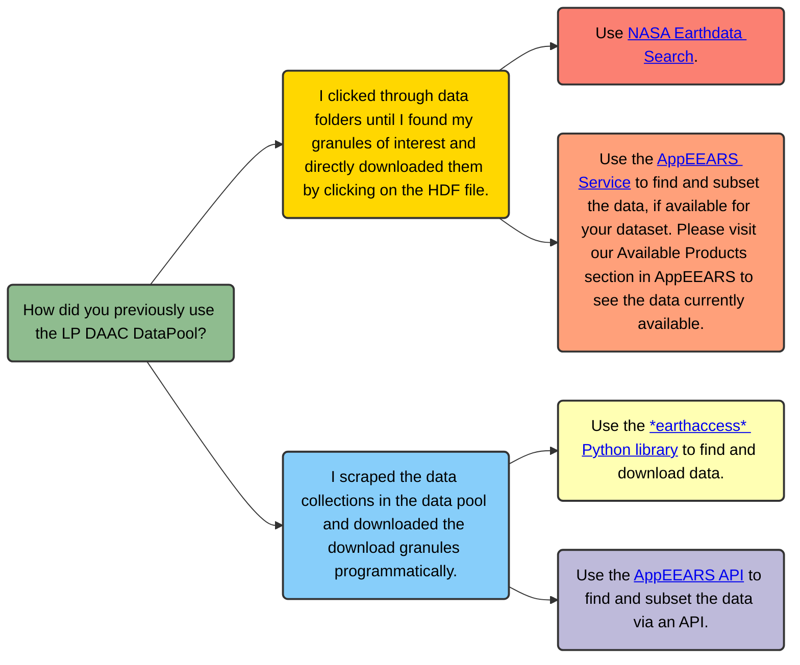

# What do I do after Data Pool?

As we continue to move all of the archived LP DAAC data to the NASA Earthdata Cloud, all Terra, Aqua, and Combined MODIS data will be removed from the LP DAAC Data Pool on June 30, 2025. This flow diagram highlights pathways that can be used to access MODIS and other datasets that are no longer available on the LP DAAC Data Pool and serves to help prepare users for when the LP DAAC Data Pool is fully retired in the future. Please note, this is not an exhaustive list of all methods, just a few recommendations to accomplish goals based on previous access workflows. For a full list of data access methods, please see our [Data Access Guide](https://github.com/nasa/LPDAAC-Data-Resources/blob/main/guides/NASA_LPDAAC_Data_Access_Guide.md). Typically we recommend using [AppEEARS](https://appeears.earthdatacloud.nasa.gov/) when possible, especially for MODIS, because it can reduce the processing steps needed. If a data product is available, AppEEARS can subset data based on spatial, temporal, and variables, as well as perform reprojection, and reformat to more user-friendly formats, such as cloud-optimized geotiff or netCDF-4. However, if your dataset is not currently available in AppEEARS, please use this flowchart to help determine the best next steps for you. 

> **Please note: if you were previously accessing the LP DAAC DataPool via CMR, you will need to update the data provider from "LPDAAC_ECS" to "LPCLOUD".** 

## Flow Diagram

## Contact Info  

Email: <LPDAAC@usgs.gov>  
Voice: +1-866-573-3222  
Organization: Land Processes Distributed Active Archive Center (LP DAAC)¹  
Website: <https://www.earthdata.nasa.gov/centers/lp-daac>  

¹Work performed under USGS contract G15PD00467 for NASA contract NNG14HH33I.